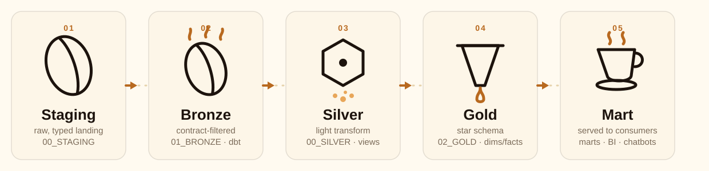
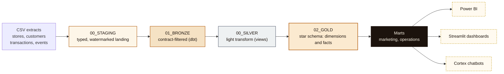

<div align="center">


# Nero Loyalty Data Platform

A contract-governed Snowflake pipeline for Caffè Nero's loyalty and sales
data, encompassing ingestion, dbt transformation, governance, and the
dashboards, chatbots, and Power BI marts constructed on top of it.

</div>

<br/>



<br/>

## Overview

Four CSV extracts (`stores`, `loyalty_customers`, `transactions`,
`loyalty_events`) are ingested into Snowflake, validated against a versioned
data contract, and transformed through a five-stage medallion pipeline. The
resulting outputs comprise a Kimball star schema, three business marts, a
governance and security layer, five dashboards, and eleven Cortex-powered
chatbots. Every component described in this document is implemented,
tested, and deployed against the live account.

## Architecture



Each stage constitutes a distinct, versioned, contract-governed process
rather than a naming convention.

| Stage | Schema | Owner | Function |
|---|---|---|---|
| **Staging** | `NERO_DB."00_STAGING"` | Ingestion adapters | Typed landing, one row per source record, with a watermark (`ingested_at`) recorded per batch. No validation is applied at this stage. |
| **Bronze** | `NERO_DB."01_BRONZE"` | dbt | Every contract rule is enforced in SQL (`WHERE` and `QUALIFY` clauses), including nullability, enumerated values, foreign keys, and the reward identifier policy. `bronze_transactions` uses dbt's native incremental materialization. |
| **Silver** | `NERO_ANALYTICS."00_SILVER"` | dbt | Light transformation, implemented as views only, with one `silver_*` object per bronze source. |
| **Gold** | `NERO_ANALYTICS."02_GOLD"` | dbt | Kimball star schema comprising `DIM_*` and `FACT_*` objects, including a complete SCD2 customer-tier snapshot. |
| **Marts** | `NERO_ANALYTICS."03/04_MART_*"` | dbt | `mart_store_daily_performance`, `mart_customer_loyalty_activity` (PII-safe), and `mart_reward_redemption_daily`, which constitute the data source consumed by Power BI. |

## Governance

The governance layer operates in parallel with the pipeline rather than as a
downstream addition.

| Schema | Purpose |
|---|---|
| `NERO_DB."02_CONTROL"` | Live contract-rejection rate per dataset (`CONTRACT_REJECTIONS`). |
| `NERO_DB."04_METADATA"` | Freshness metrics (`DATASET_FRESHNESS`), watermarks, and per-model run history, recorded automatically by a dbt `on-run-end` hook. |
| `NERO_DB."05_PII_CONTROL"` | PII column registry, derived from the contract's own tags. |
| `NERO_ANALYTICS."05_QUALITY"` | Persisted results of every `dbt build` test, rather than output visible only to the invoking session. |
| `NERO_GOVERNANCE.SECURITY` / `.COST` | Trust Center findings, login activity, ACCOUNTADMIN role holders, and warehouse or Cortex compute expenditure. |
| `NERO_GOVERNANCE.REPORTING` | A Power BI-facing view layer wrapping the schemas above. |

## Applications built on the platform

- **Platform Governance.** A single Streamlit dashboard comprising six tabs: pipeline health, security and governance, data quality, platform cost, chatbot cost, and chatbot security.
- **Loyalty Engagement and Sales.** A dashboard intended for store operations and marketing stakeholders, organized around three questions: which stores or regions lead or lag in engagement, how loyalty activity relates to spend, and which additional observations merit attention.
- **Nero Assistant and ten leader-persona chatbots.** Cortex Agents operating over a loyalty semantic model and a security-findings search service, each executed under its own least-privilege service role.
- **Power BI.** A dedicated read-only service identity, scoped exclusively to the three marts listed above.

## Repository structure

```
sources/definitions/     DCM-managed schema definitions, organized by schema (see its own README)
ingestion/                Data contract (ingestion/contract/) and the generator that produces sources/definitions/
analytics/                dbt project: bronze, silver, gold, marts, snapshots, tests, and macros
account_setup/            Idempotent SQL: roles, grants, warehouses, chatbot stacks, and governance views
streamlit_apps/           Dashboards, chatbots, and leader-persona applications (snowflake.yml is the deployment manifest)
docs/                     Illustration assets referenced by this document
```

## Getting started

```bash
# 1. Generate DCM definitions from the contract
python ingestion/build.py --seed -c <connection>

# 2. Deploy the dbt project (bronze, silver, gold, marts)
cd analytics && dbt deps && dbt build --target prod

# 3. Deploy a dashboard
cd streamlit_apps && snow streamlit deploy platform_governance --replace -c <connection>
```

Refer to `analytics/README.md` and `sources/definitions/README.md` for a
complete account of the ownership boundaries among DCM, dbt, and plain SQL,
and `ingestion/README.md` for how the ingestion engine works, what it
enforces, and how to open a pull request for a new or changed source.
