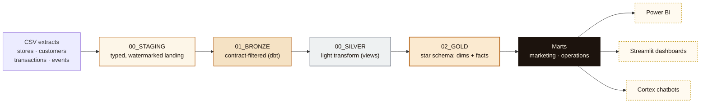

<div align="center">


# Nero Loyalty Data Platform

**Raw CSVs in, trustworthy answers out.** A contract-governed Snowflake
pipeline for Caffè Nero's loyalty & sales data — ingestion, dbt transforms,
governance, and the dashboards/chatbots/Power BI marts built on top of it.

</div>

<br/>


<br/>

## What this is

Four CSV extracts (`stores`, `loyalty_customers`, `transactions`,
`loyalty_events`) land in Snowflake, get checked against a versioned data
contract, transformed through a five-stage medallion pipeline, and come out
the other end as a star schema, three business marts, a governance/security
layer, five dashboards, and eleven Cortex-powered chatbots — all built,
tested, and deployed live against this account, not sketched out on paper.

## Architecture



Every stage is a real, versioned, contract-governed step — not a naming
convention:

| Stage | Schema | Owner | What happens |
|---|---|---|---|
| **Staging** | `NERO_DB."00_STAGING"` | ingestion adapters | Typed landing, one row per source record, watermark (`ingested_at`) per batch. Nothing validated yet. |
| **Bronze** | `NERO_DB."01_BRONZE"` | dbt | Every contract rule enforced in SQL (`WHERE` + `QUALIFY`) — nullability, enums, foreign keys, reward-id policy. `bronze_transactions` is dbt-native incremental. |
| **Silver** | `NERO_ANALYTICS."00_SILVER"` | dbt | Light transform, views only — one `silver_*` per bronze source. |
| **Gold** | `NERO_ANALYTICS."02_GOLD"` | dbt | Kimball star schema: `DIM_*` / `FACT_*`, including a full SCD2 customer-tier snapshot. |
| **Marts** | `NERO_ANALYTICS."03/04_MART_*"` | dbt | `mart_store_daily_performance`, `mart_customer_loyalty_activity` (PII-safe), `mart_reward_redemption_daily` — what Power BI actually reads. |

## Governance, alongside the pipeline

| Schema | Purpose |
|---|---|
| `NERO_DB."02_CONTROL"` | Live contract-rejection rate per dataset (`CONTRACT_REJECTIONS`) |
| `NERO_DB."04_METADATA"` | Freshness (`DATASET_FRESHNESS`), watermarks, and per-model run history — logged automatically by a dbt `on-run-end` hook |
| `NERO_DB."05_PII_CONTROL"` | PII column registry, sourced from the contract's own tags |
| `NERO_ANALYTICS."05_QUALITY"` | Every `dbt build` test result, persisted (not just visible to whoever ran the CLI) |
| `NERO_GOVERNANCE.SECURITY` / `.COST` | Trust Center findings, login activity, ACCOUNTADMIN holders, warehouse/Cortex spend |
| `NERO_GOVERNANCE.REPORTING` | The Power BI-facing wrapper over all of the above |

## What's built on top

- **Platform Governance** — one Streamlit dashboard, six tabs: pipeline health, security & governance, data quality, platform cost, chatbot cost, chatbot security.
- **Loyalty Engagement & Sales** — a store-ops/marketing dashboard, structured around three questions: which stores/regions lead or lag on engagement, how loyalty relates to spend, and what else is worth attention.
- **Nero Assistant + 10 leader-persona chatbots** — Cortex Agents over a loyalty semantic model and a security-findings search service, each running as its own least-privilege service role.
- **Power BI** — a dedicated read-only service identity scoped to exactly the three marts above.

## Repo structure

```
sources/definitions/     DCM-managed schema definitions, one folder per schema (see its own README)
ingestion/                Data contract (ingestion/contract/) + the generator that builds sources/definitions/
analytics/                dbt project: bronze → silver → gold → marts, snapshots, tests, macros
account_setup/            Idempotent SQL: roles, grants, warehouses, chatbot stacks, governance views
streamlit_apps/           Dashboards, chatbots, and leader-persona apps (snowflake.yml is the real deploy manifest)
docs/                     This README's illustration
```

## Getting started

```bash
# 1. Generate DCM definitions from the contract
python ingestion/build.py --seed -c <connection>

# 2. Deploy the dbt project (bronze → silver → gold → marts)
cd analytics && dbt deps && dbt build --target prod

# 3. Deploy a dashboard
cd streamlit_apps && snow streamlit deploy platform_governance --replace -c <connection>
```

See `analytics/README.md` and `sources/definitions/README.md` for the full
ownership boundaries between DCM, dbt, and plain SQL.
