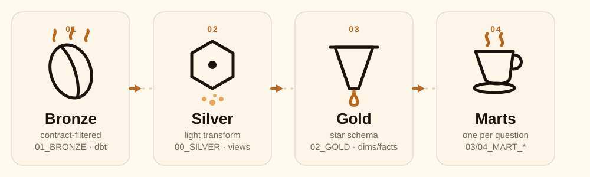

# Contributing to the transformation layer

How the dbt project turns bronze into silver, gold, and marts, what is
enforced along the way, and how to open a pull request for a new or
changed model. See `analytics/README.md` for the ownership boundary,
schema layout, and local setup; this document covers the PR path
specifically.



## How it works

- Every model is plain dbt: a `.sql` file under
  `analytics/models/<layer>/`, referencing its inputs with `ref()`
  (never a hardcoded schema path), plus a `.yml` file in the same
  directory declaring its tests.
- dbt resolves the dependency graph from `ref()` calls alone, so a model
  that does not exist in the DAG cannot be built or referenced by name.
- Two on-run-end hooks fire after every `dbt build`, regardless of pass
  or fail, and persist what happened into Snowflake:
  - `log_dbt_test_results.sql`: every test's outcome, into
    `NERO_ANALYTICS."05_QUALITY".DBT_TEST_RESULTS`.
  - `log_pipeline_run.sql`: every model's status, duration, and rows
    affected, into `NERO_DB."04_METADATA".PIPELINE_RUN_LOG`, refreshing
    the dataset watermarks alongside.
  - This is observability, not enforcement. It records what a run did;
    it does not decide whether the run succeeds.
- The project also exists as a native `DBT PROJECT` object in Snowsight
  (`NERO_ANALYTICS.DBT_PROJECT.NERO_ANALYTICS`), separate from the
  CLI/CI path described here. Merging a PR does not redeploy it
  automatically; see "After merge" below.

## What is enforced

- **The `ref()`-only rule**, enforced by dbt at compile time. A model
  that reaches across the DAG with a hardcoded schema path instead of
  `ref()`/`source()` will still run, but breaks dbt's own dependency
  ordering and lineage. Every model in this project uses `ref()`; keep
  it that way.
- **Generic tests** (`not_null`, `unique`, `relationships`,
  `accepted_values`), declared per column in each layer's `.yml` file.
  These fail the build, not just warn, unless a test is explicitly
  marked `severity: warn`.
- **Singular tests** (`analytics/tests/`): no customer SCD interval
  overlap, exactly one current version per `customer_id`,
  fact-to-staging count and amount reconciliation, no null dimension
  surrogate keys, and an unknown-member rate held below an agreed
  threshold. These exist because a generic test cannot express them;
  reach for one whenever a rule spans more than one column or model.
- **The grant boundary**, enforced by Snowflake, not dbt: `NERO_DBT_ROLE`
  has `SELECT` only on `NERO_DB."00_STAGING"` and `CREATE TABLE` only on
  `NERO_DB."01_BRONZE"`, nothing else in `NERO_DB`. A model that tries
  to write anywhere else in `NERO_DB` fails on privileges, not on dbt
  logic.
- **CI**, `.github/workflows/dbt-ci.yml`: any PR touching `analytics/**`
  runs `dbt deps`, `debug`, `parse`, `compile`, and a full `dbt build`
  into an isolated `DBT_CI_<PR_NUMBER>` schema under `NERO_DBT_ROLE`,
  then drops that schema on completion regardless of outcome. A red
  check on this workflow means the build failed in a real Snowflake
  schema, not a lint warning.

**Not enforced**, stated plainly: merging to `main` does not
automatically redeploy the native `DBT PROJECT` object. That redeploy is
a separate, manual `snow dbt deploy` (see `analytics/README.md`'s "dbt
Projects on Snowflake" section). This is not just a Snowsight display
issue, `SYNTHETIC_DAILY_INGEST_TASK`'s DAG
(`account_setup/daily_pipeline_orchestration.sql`) calls
`EXECUTE DBT PROJECT NERO_ANALYTICS.DBT_PROJECT.NERO_ANALYTICS`, the
native project object, not the CLI. Every scheduled production run
executes whatever was last deployed there, which can silently lag behind
`main` by however long it's been since the last `snow dbt deploy`.

Confirmed the hard way: a `cluster_by` config change (PR #78) was
verified locally with `dbt build` and merged, but the native project was
never redeployed. The next scheduled DAG run rebuilt every plain
`materialized: table` model (anything not `incremental`, which only gets
merged into, not recreated) using the stale pre-change code, silently
dropping the new clustering keys the moment those tables were rebuilt.
Local `dbt build` passing is not evidence a merged change is actually
live in production; only a `snow dbt deploy` followed by a run through
that same native project confirms it. Whoever merges a transformation PR
is responsible for that redeploy; nothing currently does it for them.

## Opening a PR

1. **Identify the layer.** A new column on an existing dataset touches
   `bronze` (the contract's job, see `ingestion/README.md`) and possibly
   `silver`/`gold`/marts downstream of it. A new derived metric or
   reporting cut is a `gold` or mart change only.
2. **Write the model and its tests together.** Use `ref()` for every
   input, and add or update test entries in the layer's `.yml` file in
   the same PR, not a follow-up. A model without at least a primary-key
   `unique`/`not_null` pair is under-tested.
3. **Check singular test coverage.** If the change affects a fact or a
   mart, check whether an existing singular test needs a matching
   update (a new dimension usually needs a reconciliation test's column
   list extended), or whether it warrants a new singular test.
4. **Build locally first.** Run `dbt build --target dev` against your
   own dev schema before opening the PR. `dev` is the configured target
   in `~/.dbt/profiles.yml` per `analytics/README.md`'s local setup; do
   not develop against `prod`.
5. **Let CI confirm it.** Open the PR against `main`. CI builds it into
   an isolated `DBT_CI_<PR_NUMBER>` schema automatically; wait for that
   to pass rather than relying on the local dev build alone. The
   isolated schema catches grant and environment issues a personal dev
   schema can hide.
6. **State what changed and what needs a follow-up.** In the PR
   description, name the layer changed, the test coverage added, and
   confirm the native `DBT PROJECT` object was redeployed (see "After
   merge"), not just that it will be at some point.

## After merge

Redeploy the native `DBT PROJECT` object. This is required, not
optional cleanup, `DBT_DAILY_REFRESH_TASK` (the scheduled task every
production run goes through) executes whatever is deployed there, not
whatever is on `main`. Until this runs, the scheduled task keeps
rebuilding `table`-materialized models from the pre-merge code on its
normal schedule, which can silently revert a merged change the next
time it fires:

  ```bash
  snow dbt deploy nero_analytics --source . --profiles-dir . \
    -c <connection> --database NERO_ANALYTICS --schema DBT_PROJECT
  ```
