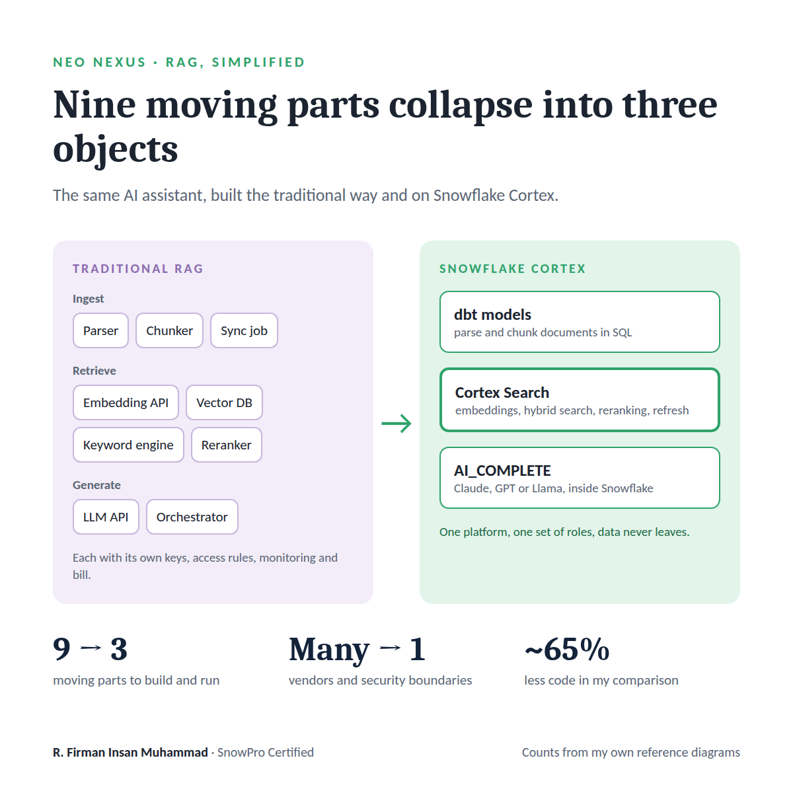
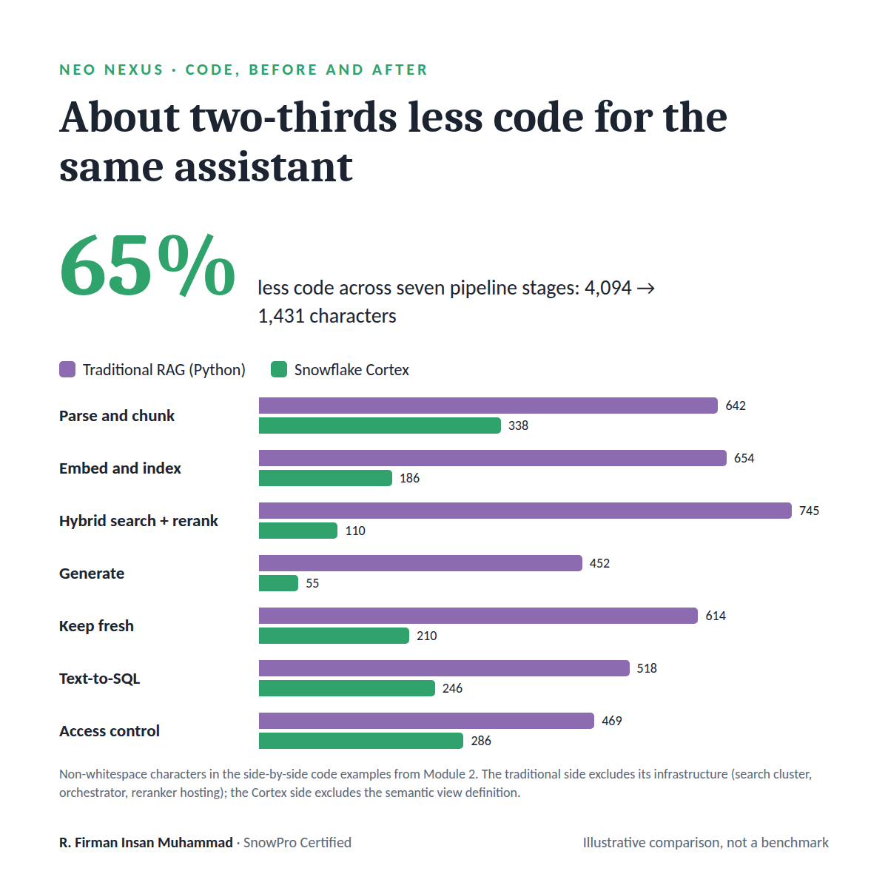
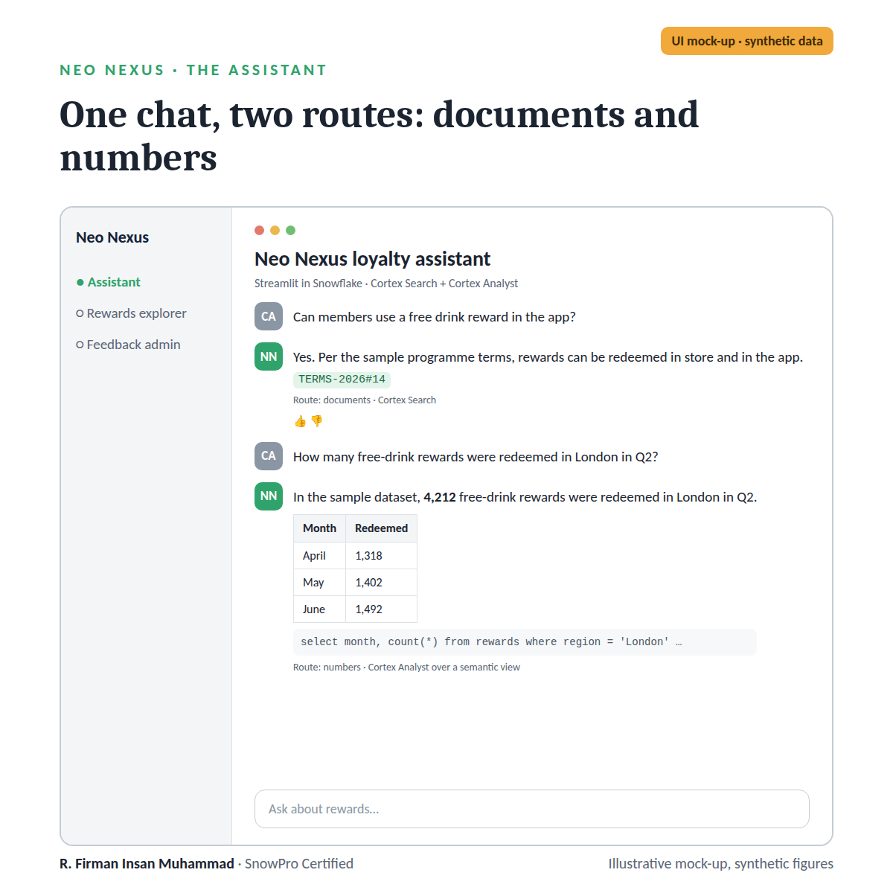
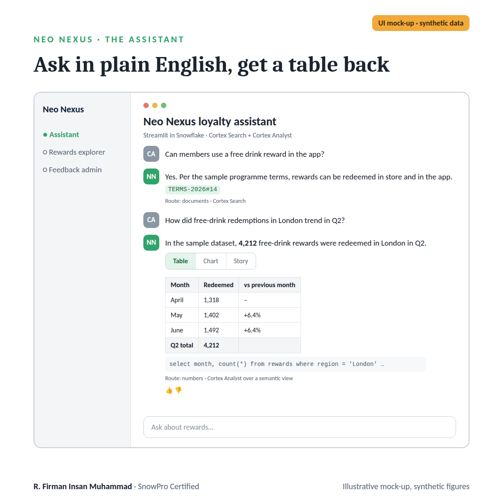
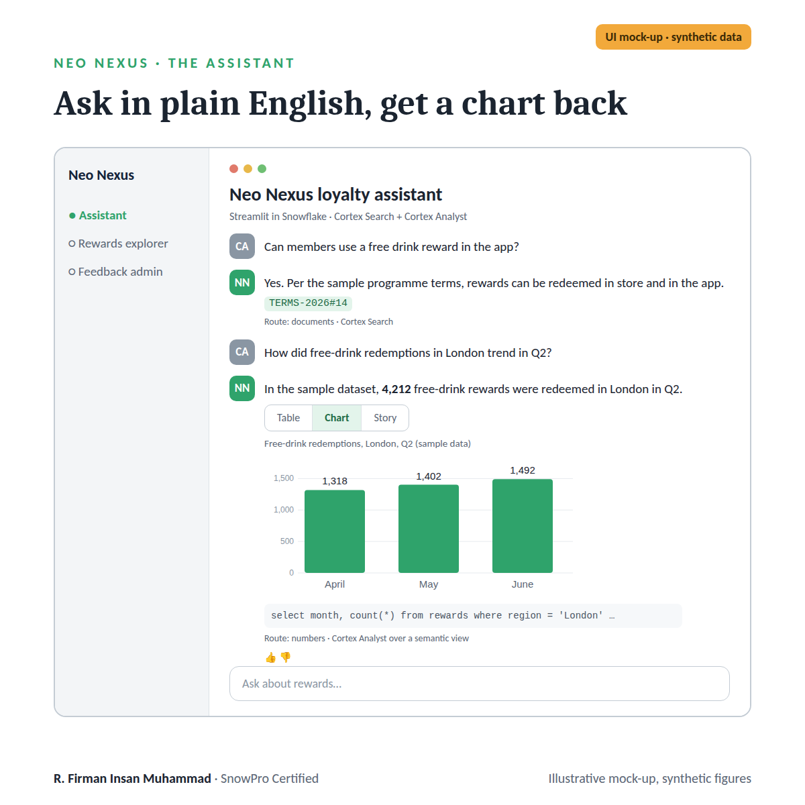
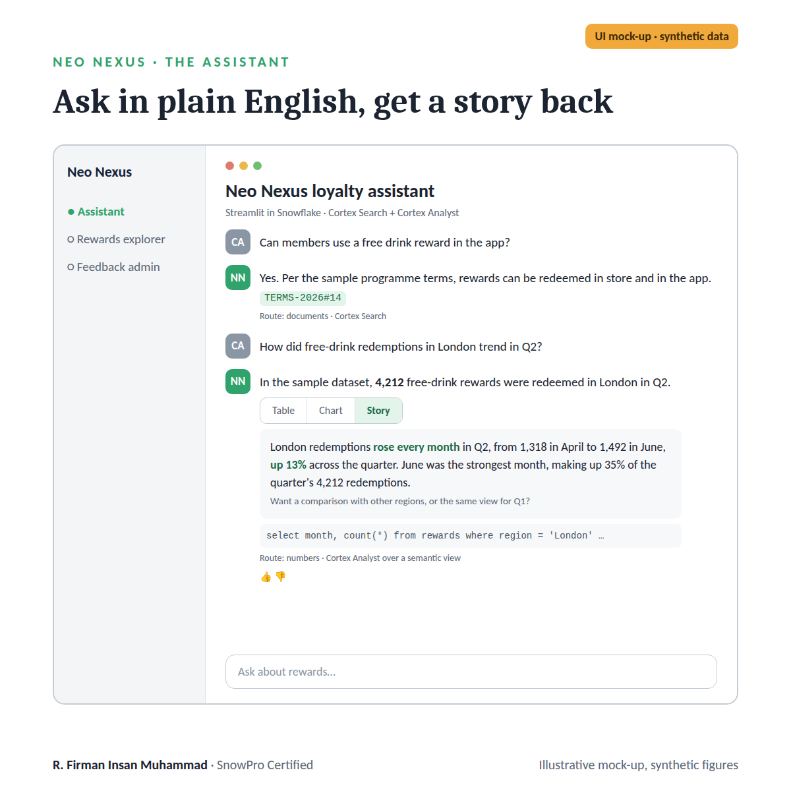

# Enterprise AI Assistants: From RAG to Snowflake Cortex

A six-module course that builds one enterprise AI assistant, Neo Nexus,
a loyalty assistant for Caffè Nero, and rebuilds it six times: from a
first retrieval-augmented prototype to a governed, evaluated, production
service reachable from other platforms. Each module picks up where the
previous one stopped.

The scenario is illustrative: all data, documents and figures in the
slides are synthetic.

<table>
<tr>
<td width="50%"></td>
<td width="50%"></td>
</tr>
</table>

## Start here

| File | Contents |
|---|---|
| [`highlights.pdf`](highlights.pdf) | 14 pages: a condensed overview of the course |
| [`full-course.pdf`](full-course.pdf) | 172 pages: all six modules in one file |

## Modules

| # | Module | What it covers | Slides |
|---|---|---|---|
| 1 | **Foundations of Retrieval-Augmented Generation** | How AI assistants answer from enterprise data: embeddings, vector search and grounded responses, built with Postgres, pgvector and an LLM API | [PDF, 27 pages](01-foundations-of-rag.pdf) |
| 2 | **Snowflake Cortex on a Governed Data Foundation** | Rebuilding the assistant inside Snowflake on dbt-modelled data: Cortex Search for documents, Cortex Analyst for metrics | [PDF, 37 pages](02-cortex-on-a-governed-foundation.pdf) |
| 3 | **Evaluating and Optimising AI Assistants** | Learning from conversations: logging, feedback, evaluation, and improving the assistant one measured change at a time | [PDF, 28 pages](03-evaluating-and-optimising.pdf) |
| 4 | **Data Apps with Streamlit and Its Siblings** | From a Python script to a shared, governed app: Streamlit fundamentals, Streamlit in Snowflake, and where Gradio, Dash, Shiny and Databricks Apps fit | [PDF, 26 pages](04-streamlit-and-its-siblings.pdf) |
| 5 | **Deploying AI Assistants to Production** | Shipping on Streamlit in Snowflake: project structure, environments, CI/CD with an evaluation gate, least-privilege security and day-two operations | [PDF, 26 pages](05-deploying-to-production.pdf) |
| 6 | **Cortex Beyond Snowflake** | Taking the assistant to other apps, AI systems and tools: REST APIs, Cortex Agents, MCP, Microsoft Teams and Slack | [PDF, 28 pages](06-cortex-beyond-snowflake.pdf) |

## The assistant

UI mock-ups of Neo Nexus from the course (synthetic data). One chat
routes each question to documents (Cortex Search) or numbers (Cortex
Analyst over a semantic view), and a numeric answer can come back as a
table, a chart, or a short story.

<table>
<tr>
<td width="50%"></td>
<td width="50%"></td>
</tr>
<tr>
<td></td>
<td></td>
</tr>
</table>

## How it relates to this repository

The course and this repository cover the same ground from two sides.
The slides teach the concepts; the repository is a working
implementation of many of them:

| Course topic | Where it lives in this repository |
|---|---|
| Governed data foundation (Module 2) | `analytics/` (dbt medallion pipeline), `ingestion/contract/` (data contract) |
| Cortex Search and Cortex Analyst (Module 2) | `account_setup/cortex_chatbot_stack.sql`, `streamlit_apps/chatbots/README.md` |
| Streamlit in Snowflake apps (Module 4) | `streamlit_apps/` |
| Least-privilege roles and deployment (Module 5) | `account_setup/`, `streamlit_apps/snowflake.yml` |
| Cortex Agents and MCP (Module 6) | `NERO_PLATFORM_AGENT` and `NERO_PLATFORM_MCP_SERVER`, see `streamlit_apps/chatbots/README.md` |
