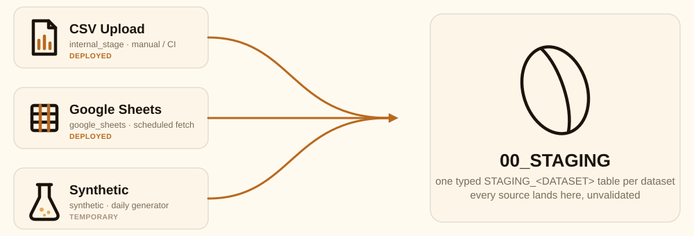

# Ingestion

How raw data enters the platform, what is enforced along the way, and how
to open a pull request for a new or changed ingestion source.

## How it works

- `ingestion/contract/` is the single versioned document describing
  ingestion. It is split across two file kinds for readability, and
  `ingestion/contract_loader.py` is the one place that recombines them
  into a single logical document and a single SHA-256 hash
  (`contract_hash`), so a byte change anywhere is always visible.
  - `meta.yaml`: `contract_id`, `version`, `wire_format`, `freshness`,
    `ingestion.sources` (every mechanism that can land data), and
    `ingestion.landing` (how it is landed once it arrives).
  - `datasets/*.yaml`, one per dataset: `primary_key`, `owners`,
    `columns` (type, nullability, enum, foreign key, PII tagging), and
    `policies`.
- `python ingestion/build.py` reads the contract and generates the SQL
  that deploys it. Nothing downstream reads the YAML files directly at
  runtime; the generator is the only bridge between the contract and
  live Snowflake objects.
- Three adapters land data using that generated schema, all writing into
  the same typed `STAGING_<DATASET>` tables shown above:
  - `ingestion/load_csv_batch.py`: manual or CI CSV upload. Reads the
    contract directly, since it runs locally.
  - `account_setup/synthetic_daily_ingest.sql`: a temporary generator.
    Hardcodes its own copy of contract values, since Snowflake stored
    procedures cannot read repo files.
  - `account_setup/google_sheets_ingest.sql` plus
    `ingestion/generated/google_sheets_procedure.sql`: a scheduled
    fetch. Values are baked in by the generator, for the same reason.
- From staging, dbt (`analytics/models/bronze/`) takes over: it filters
  by the contract's rules in plain SQL and publishes to `01_BRONZE`.
  Everything past that point is dbt's project, not the contract's; see
  `analytics/CONTRIBUTING.md`.

## What this engine enforces

As of contract v7, concretely:

- **Column shape.** Enforced by `bronze_<dataset>.sql`'s `WHERE` clause
  at publish time: nullability, `VARCHAR` length, numeric
  precision/scale, enumerated values (`format`, `tier`, `event_type`,
  `payment_type`), and one hand-written policy rule (a `redeem` event
  must carry a `reward_id`).
- **Referential integrity.** Enforced the same way: every foreign key
  (`home_store_id`, `store_id`, `customer_id`) must resolve in the
  parent dataset's bronze table before a row is published.
- **Regression safety net.** Enforced by dbt tests in
  `analytics/models/bronze/bronze.yml`: `not_null` and `unique` on every
  primary key, `accepted_values` on every enum, `relationships` on every
  foreign key. These do not gate publishing; the `WHERE` clause already
  filtered bad rows out. They exist to fail a `dbt build` loudly if the
  filtering logic itself ever drifts from the contract.
- **Schema validity of the contract itself.** Enforced by
  `contract_loader.py`'s `ALLOWED` key sets: an unknown key anywhere in
  `meta.yaml` or a `datasets/*.yaml` file fails the load immediately,
  rather than being silently ignored.
- **Duplicate source names.** Enforced the same way: two entries in
  `ingestion.sources` cannot share a `name`.

**Declared but not yet enforced**, stated plainly rather than implied:
`freshness.max_snapshot_age_minutes` is schema-validated, but nothing
currently reads it to alert or fail a build if staging goes stale past
that threshold. `NERO_DB."04_METADATA".DATASET_FRESHNESS` computes the
actual lag live and would be the natural place to wire a check against
it, but that check does not exist yet.

## Adding or changing an ingestion source

- **Changing an existing source's configuration** (a URL, a schedule):
  edit its entry under `ingestion.sources` in `meta.yaml` only. Do not
  touch `account_setup/*.sql` by hand for a value the generator can
  produce.
- **Adding a new dataset** to an existing source: add
  `ingestion/contract/datasets/<name>.yaml`, add it to every relevant
  `ingestion.sources[].datasets` list, then follow the checklist below.
  Downstream, this also needs a corresponding `bronze_<name>.sql` model
  and its test entries in `bronze.yml`, both outside `ingestion/`.
- **Adding a new source mechanism** (a different feed entirely): add an
  entry to `ingestion.sources` in `meta.yaml` with a new `name`, a
  `type`, the `datasets` it covers, a `status`
  (`deployed`/`unverified`/`temporary`), and a type-specific config
  block. If `contract_loader.py` does not recognize the type-specific
  keys needed, add them to `ALLOWED["source"]` in the same PR, not as a
  follow-up.

### Checklist before opening a PR

1. Edit the contract (`meta.yaml` and/or `datasets/*.yaml`). Bump
   `version` for a structural change (a new source type, a new dataset,
   a changed column); do not bump it for a like-for-like value swap (a
   rotated URL for an already-declared source).
2. Run `python ingestion/build.py` and review the diff under
   `sources/definitions/`, `ingestion/generated/`, and
   `ingestion/reference/`. These are generated; never hand-edit them.
3. If `sources/definitions/` changed, run
   `snow dcm plan 'NERO_DB.PUBLIC.NERO_LOYALTY_PROJECT' -c <connection>`
   and confirm the plan matches what is expected (no surprise drops).
4. If a generated procedure is new or changed
   (`ingestion/generated/*.sql`), check its header comment for the apply
   order relative to any hand-maintained `account_setup/*.sql` file it
   depends on. Snowflake's own object dependencies (an integration
   before the procedure that references it, a procedure before a grant
   on it) are not optional to sequence correctly.
5. Deploy to a real connection and verify live: run the DCM deploy for
   real, apply the generated/hand-maintained SQL in order, and call any
   new or changed procedure directly rather than only trusting its
   scheduled task.
6. Run `dbt build --target prod` and confirm it passes. A contract
   change that adds or renames a column needs a matching change in the
   relevant `bronze_<dataset>.sql` model and `bronze.yml` test entries
   in the same PR, not a follow-up.
7. State in the PR description what was verified live (plan output, a
   direct procedure call, the `dbt build` result), not only that the
   generator ran without error. A clean generator run confirms the
   contract parses; it does not confirm the deployed objects behave
   correctly.
