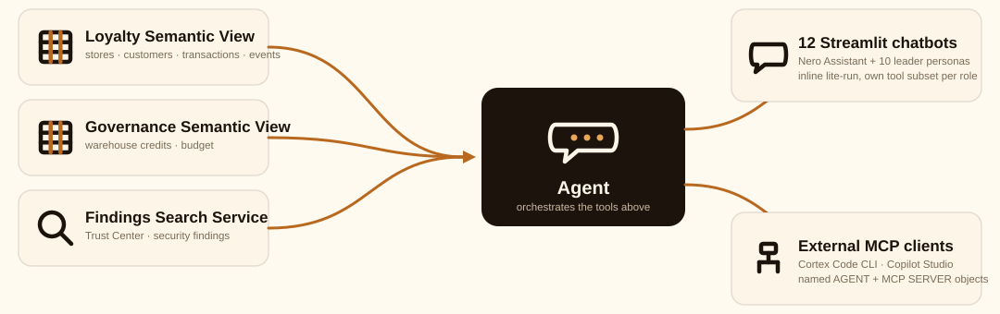
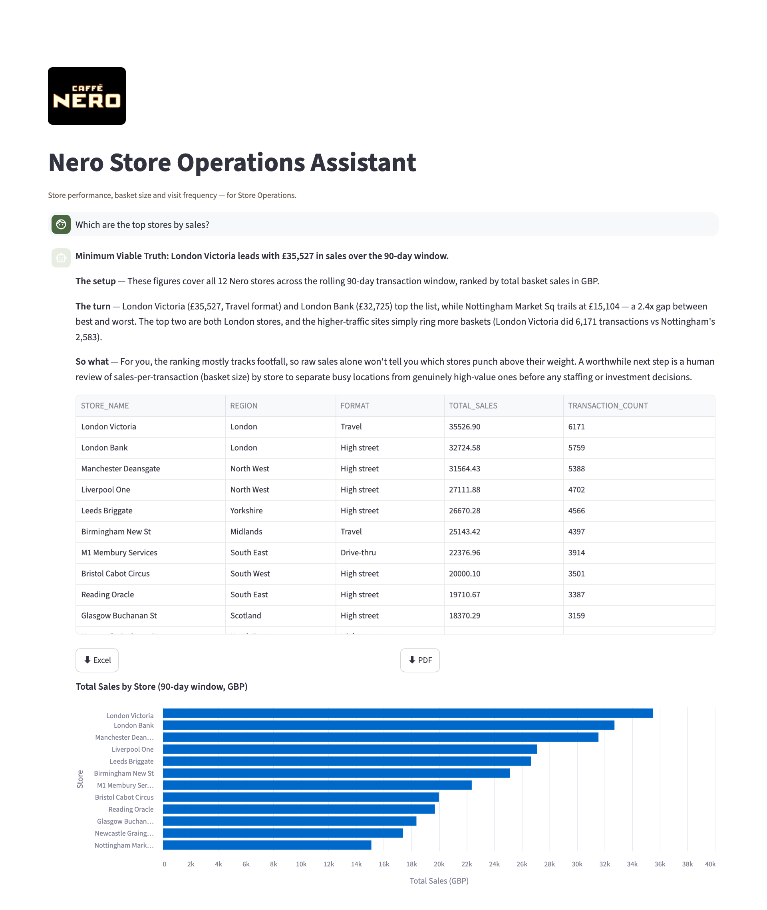
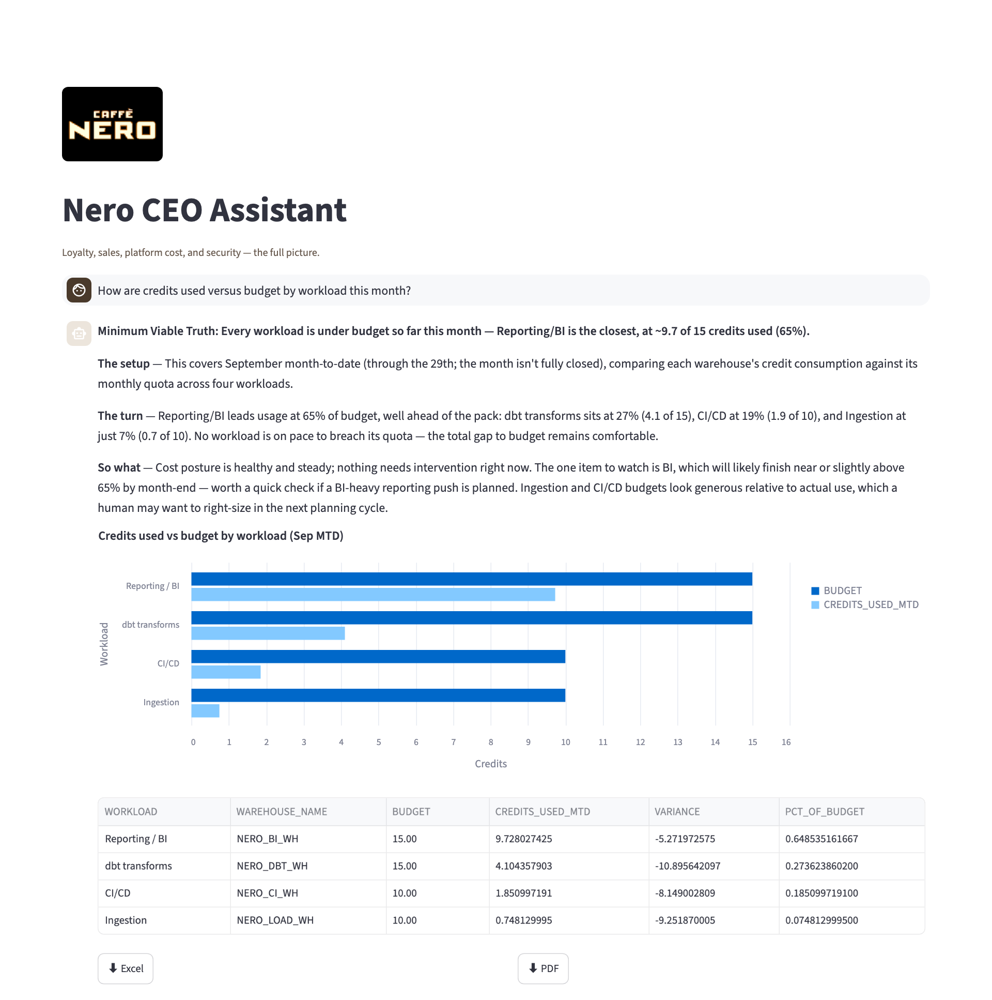
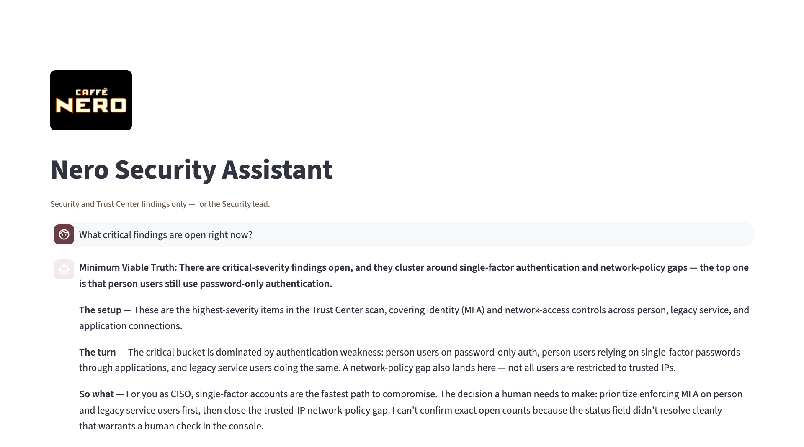

# Cortex Analyst and Cortex Agent

Where the semantic views, search service, agent, and MCP server live in
this project, the exact SQL syntax that built each one, and how the
twelve chatbot applications consume them. Snowflake's own documentation
covers the concepts in general; this document covers what was actually
built here.



## Official documentation

- Cortex Analyst: https://docs.snowflake.com/en/user-guide/snowflake-cortex/cortex-analyst
- Cortex Agents: https://docs.snowflake.com/en/user-guide/snowflake-cortex/cortex-agents
- Semantic views (the object Cortex Analyst reads): https://docs.snowflake.com/en/user-guide/views-semantic/overview
- Cortex Search: https://docs.snowflake.com/en/user-guide/snowflake-cortex/cortex-search/cortex-search-overview

## How it works

- A **semantic view** describes a set of tables to Cortex Analyst as
  facts, dimensions, and metrics, so it can translate a natural-language
  question into SQL. This project has two: `LOYALTY_SEMANTIC_VIEW`
  (stores, customers, transactions, loyalty events) and
  `GOVERNANCE_SEMANTIC_VIEW` (warehouse credit usage and budget).
- A **Cortex Search Service** indexes a text column for semantic search.
  `FINDINGS_SEARCH_SVC` indexes Trust Center security findings.
- These three are the platform's only two kinds of *tools*. Everything
  else, the named agent, the MCP server, and every chatbot's own inline
  request, is a different way of pointing at the same two tool types.
- Two separate integration patterns consume them, not one:
  - **Named objects** (`NERO_PLATFORM_AGENT`, `NERO_PLATFORM_MCP_SERVER`)
    for external clients that need to discover and call tools over a
    protocol, Cortex Code CLI, Copilot Studio, anything speaking MCP.
  - **Inline lite-run requests** for the Streamlit chatbots themselves.
    Each app calls the Cortex Agent lite-run API directly with its own
    `tool_resources` payload (built from the same two semantic views and
    the same search service) rather than referencing the named agent
    object by name. This is why `CORTEX_AGENT_USAGE_HISTORY.AGENT_NAME`
    is always null for chatbot traffic: there is no named agent involved
    in that path.
- All four live in `NERO_GOVERNANCE.CORTEX_TOOLS`, except
  `FINDINGS_SEARCH_SVC` and its source table `FINDINGS_DOCS`, which live
  in `NERO_GOVERNANCE.SECURITY` alongside the rest of the security
  findings data it indexes.

## Where each object is defined

| Object | Type | Schema | Source file |
|---|---|---|---|
| `LOYALTY_SEMANTIC_VIEW` | Semantic view | `NERO_GOVERNANCE.CORTEX_TOOLS` | `account_setup/cortex_chatbot_stack.sql` |
| `GOVERNANCE_SEMANTIC_VIEW` | Semantic view | `NERO_GOVERNANCE.CORTEX_TOOLS` | `account_setup/governance_chatbot_stack.sql` |
| `FINDINGS_SEARCH_SVC` | Cortex Search Service | `NERO_GOVERNANCE.SECURITY` | `account_setup/cortex_chatbot_stack.sql` |
| `NERO_PLATFORM_AGENT` | Agent | `NERO_GOVERNANCE.CORTEX_TOOLS` | `account_setup/cortex_chatbot_stack.sql` |
| `NERO_PLATFORM_MCP_SERVER` | MCP Server | `NERO_GOVERNANCE.CORTEX_TOOLS` | `account_setup/cortex_chatbot_stack.sql` |
| Nero Assistant, Nero Governance Assistant | Streamlit, inline lite-run | `NERO_GOVERNANCE.APPS_CHATBOTS` | `streamlit_apps/chatbots/nero_assistant/`, `nero_governance_assistant/` |
| 10 leader personas (CEO, CX, CDO, Finance, Marketing, Ops, Audit, Regional, Security Lead, Platform Lead) | Streamlit, inline lite-run, shared engine | `NERO_GOVERNANCE.APPS_LEADERS` | `streamlit_apps/leaders/persona_core.py` + one ~20-line entrypoint per persona |

`account_setup/cortex_chatbot_stack.sql` cannot be applied with
`snow sql -f`; its embedded dollar-quoted JSON specifications hit a known
Snowflake CLI templating limitation. Apply it with a plain Python
connector session instead (the file's own header comment has the exact
command).

## The SQL syntax

### Semantic view

```sql
CREATE OR REPLACE SEMANTIC VIEW NERO_GOVERNANCE.CORTEX_TOOLS.LOYALTY_SEMANTIC_VIEW
  TABLES (
    STORES AS NERO_DB."01_BRONZE".BRONZE_STORES PRIMARY KEY (STORE_ID)
      COMMENT = 'The 12 Caffe Nero store locations.',
    CUSTOMERS AS NERO_DB."01_BRONZE".BRONZE_LOYALTY_CUSTOMERS PRIMARY KEY (CUSTOMER_ID)
      COMMENT = 'Enrolled loyalty customers, with their current tier.',
    TRANSACTIONS AS NERO_DB."01_BRONZE".BRONZE_TRANSACTIONS PRIMARY KEY (TRANSACTION_ID)
      COMMENT = 'POS transactions. CUSTOMER_ID is null for walk-in (non-loyalty) baskets.',
    EVENTS AS NERO_DB."01_BRONZE".BRONZE_LOYALTY_EVENTS PRIMARY KEY (EVENT_ID)
      COMMENT = 'Loyalty events: signup, earn, redeem, tier_change.'
  )
  RELATIONSHIPS (
    TRANSACTIONS_TO_STORES AS TRANSACTIONS(STORE_ID) REFERENCES STORES(STORE_ID),
    TRANSACTIONS_TO_CUSTOMERS AS TRANSACTIONS(CUSTOMER_ID) REFERENCES CUSTOMERS(CUSTOMER_ID),
    EVENTS_TO_STORES AS EVENTS(STORE_ID) REFERENCES STORES(STORE_ID)
  )
  FACTS (
    TRANSACTIONS.BASKET_TOTAL AS BASKET_TOTAL COMMENT = 'Basket value in GBP for one transaction.',
    TRANSACTIONS.ITEM_COUNT AS ITEM_COUNT COMMENT = 'Number of items in one transaction.'
  )
  DIMENSIONS (
    STORES.STORE_NAME AS STORE_NAME,
    STORES.REGION AS REGION,
    CUSTOMERS.TIER AS TIER COMMENT = 'Bronze, Silver or Gold -- the customer''s CURRENT tier, not historical.',
    EVENTS.EVENT_TYPE AS EVENT_TYPE COMMENT = 'signup, earn, redeem or tier_change.'
  )
  METRICS (
    TRANSACTIONS.TOTAL_SALES AS SUM(TRANSACTIONS.BASKET_TOTAL) COMMENT = 'Total GBP sales.',
    TRANSACTIONS.AVG_BASKET AS AVG(TRANSACTIONS.BASKET_TOTAL) COMMENT = 'Average basket value in GBP.',
    CUSTOMERS.CUSTOMER_COUNT AS COUNT(CUSTOMERS.CUSTOMER_ID) COMMENT = 'Number of enrolled customers.'
  )
  COMMENT = 'Nero loyalty & sales semantic model for Cortex Analyst.';
```

Full column list in `account_setup/cortex_chatbot_stack.sql`. One
constraint worth knowing before adding a dimension: `CUSTOMERS.HOME_STORE_ID`
is exposed as a plain dimension, never as a second relationship to
`STORES`. A second join path to the same table (transactions to stores
directly, and again via customers) makes the graph multi-path, which
semantic views reject with "Invalid dimension specified: Multi-path
relationship... not supported."

### Cortex Search Service

```sql
CREATE OR REPLACE CORTEX SEARCH SERVICE NERO_GOVERNANCE.SECURITY.FINDINGS_SEARCH_SVC
  ON RISK_DESCRIPTION
  ATTRIBUTES SCANNER_NAME, SEVERITY, STATE, SUGGESTED_ACTION
  WAREHOUSE = NERO_BI_WH
  TARGET_LAG = '1 day'
  AS (
    SELECT FINDING_ID, SCANNER_NAME, SEVERITY, STATE, RISK_DESCRIPTION, SUGGESTED_ACTION, CREATED_ON
    FROM NERO_GOVERNANCE.SECURITY.FINDINGS_DOCS
  );
```

`FINDINGS_DOCS` exists because Cortex Search needs change tracking on a
real table it owns the refresh of; `SNOWFLAKE.TRUST_CENTER.FINDINGS` is a
shared system view, so the corpus is materialized into `FINDINGS_DOCS`
first (`INSERT ... SELECT ... FROM SNOWFLAKE.TRUST_CENTER.FINDINGS`,
re-run periodically) and the search service indexes that copy.
`TARGET_LAG` governs the search index's own refresh off `FINDINGS_DOCS`,
not how current `FINDINGS_DOCS` itself is.

### Agent

```sql
CREATE OR REPLACE AGENT NERO_GOVERNANCE.CORTEX_TOOLS.NERO_PLATFORM_AGENT
COMMENT = 'Chatbot agent for the Nero platform: structured loyalty/sales Q&A via Cortex Analyst, security/Trust Center Q&A via Cortex Search.'
FROM SPECIFICATION $$
{
  "models": {"orchestration": "auto"},
  "instructions": {
    "response": "You are the Nero Platform assistant. Answer questions about loyalty/sales data using the loyalty_analyst tool, and questions about security/Trust Center findings using the findings_search tool. Be concise and cite concrete numbers.",
    "orchestration": "Use loyalty_analyst for questions about stores, customers, transactions, baskets, or loyalty events. Use findings_search for questions about security findings, Trust Center, MFA, network policy, or compliance."
  },
  "tools": [
    {"tool_spec": {"type": "cortex_analyst_text_to_sql", "name": "loyalty_analyst"}},
    {"tool_spec": {"type": "cortex_search", "name": "findings_search"}}
  ],
  "tool_resources": {
    "loyalty_analyst": {
      "semantic_view": "NERO_GOVERNANCE.CORTEX_TOOLS.LOYALTY_SEMANTIC_VIEW",
      "execution_environment": {"type": "warehouse", "warehouse": "NERO_BI_WH"}
    },
    "findings_search": {"name": "NERO_GOVERNANCE.SECURITY.FINDINGS_SEARCH_SVC", "max_results": 5}
  }
}
$$;
```

The specification is JSON, not SQL, inside the `FROM SPECIFICATION`
block. `tools` declares each tool's type and the name the model will call
it by; `tool_resources` maps that name to the real Snowflake object.

### MCP Server

Confirmed live via `SELECT GET_DDL('mcp_server', 'NERO_GOVERNANCE.CORTEX_TOOLS.NERO_PLATFORM_MCP_SERVER')`:

```sql
CREATE OR REPLACE MCP SERVER NERO_PLATFORM_MCP_SERVER
  COMMENT = 'MCP server exposing Nero loyalty data (Cortex Analyst) and security findings (Cortex Search) as tools for external MCP clients.'
  FROM SPECIFICATION $$
  tools:
    - name: "search_security_findings"
      identifier: "NERO_GOVERNANCE.SECURITY.FINDINGS_SEARCH_SVC"
      type: "CORTEX_SEARCH_SERVICE_QUERY"
      description: "Search Trust Center security/governance findings"
    - name: "query_loyalty_data"
      identifier: "NERO_GOVERNANCE.CORTEX_TOOLS.LOYALTY_SEMANTIC_VIEW"
      type: "CORTEX_ANALYST_MESSAGE"
      description: "Ask natural-language questions about Nero loyalty/sales data"
  $$;
```

Same two tools as the agent, exposed over MCP instead of the lite-run
API, for clients that speak the Model Context Protocol rather than
calling Snowflake's Cortex Agent API directly. `account_setup/copilot_mcp_access.sql`
grants a dedicated least-privilege identity (`NERO_COPILOT_ROLE`) `USAGE`
on this server for exactly that purpose.

### Inline lite-run (what the Streamlit chatbots actually use)

No `CREATE AGENT` involved. Each app builds a request in Python and calls
the same API the named agent object would otherwise front:

```python
from snowflake.core import Root
from snowflake.core.cortex.lite_agent_service._generated.models.agent_run_request import AgentRunRequest

TOOL_DEFS = {
    "loyalty": {
        "tool_spec": {"type": "cortex_analyst_text_to_sql", "name": "loyalty_analyst"},
        "resource": {"semantic_view": "NERO_GOVERNANCE.CORTEX_TOOLS.LOYALTY_SEMANTIC_VIEW",
                     "execution_environment": {"type": "warehouse", "warehouse": "NERO_BI_WH"}},
    },
    # ... governance, search, one entry per tool a persona is allowed to use
}

root = Root(session)
req = AgentRunRequest(model="...", messages=[...], tools=[...], tool_resources={...})
resp = root.cortex_agent_service.run(req)
```

`streamlit_apps/leaders/persona_core.py` is the shared engine behind all
10 leader personas; each persona's own entrypoint file is only ~20 lines
naming which `TOOL_DEFS` keys it gets. The real access boundary isn't
this code, it's each persona's own least-privilege Snowflake role
(`account_setup/leader_personas_stack.sql`,
`account_setup/leader_personas_stack_2.sql`): this engine only decides
which of an already-granted role's tools to wire into the request, it
cannot grant a persona access to something its role does not have.

## How answers are shaped

Every answer opens with a **Minimum Viable Truth** (MVT): the single
fact that answers the question. By default the answer then tells a
short data story. Both formats, and the chart tool, live in one module,
`shared/answer_style.py`, which all 12 apps use; the apps only keep
their own role instruction and tool list.

### Answer style: a cost / depth trade-off

Users pick how much the agent writes in the sidebar, per conversation:

| Option | What the user gets | When to use it |
|---|---|---|
| **Story** (default) | MVT headline, then setup, turn and so what | Decisions, anything needing context |
| **MVT** | The headline only, plus one sentence for a caveat | Quick lookups, high-volume use |
| **Include a chart** (switch) | Adds the `data_to_chart` step | Comparisons and trends |

Measured on the same 24 questions (2 per app, each run under its own
role) against the live agent, median per answer:

| Setting | Words | Time | Charts (of 24) |
|---|---|---|---|
| Story + chart | 142 | 26.4 s | 17 |
| Story, no chart | 137 | 24.1 s | 13 |
| MVT + chart | 34 | 21.1 s | 16 |
| MVT, no chart | 39 | 18.6 s | 10 |

MVT writes about 75% less and answers about 20-30% faster. Output
length and agent steps are what drive Cortex Agent token use, so MVT is
the cheaper setting; check `SNOWFLAKE.ACCOUNT_USAGE.CORTEX_AGENT_USAGE_HISTORY`
for the credits a given period actually used. The agent sometimes charts
on its own even without `data_to_chart` (hence 10 charts with the switch
off), so the apps also hide `response.chart` events when the switch is
off: off means no charts shown, and a few seconds saved rather than zero
chart cost.


### The story format

`STORY_INSTRUCTION` in `shared/answer_style.py`:

```
**Minimum Viable Truth: <the single fact that answers the question, with its number>**

**The setup** -- the baseline, period or scope the numbers cover.
**The turn** -- what stands out: the biggest gap, change, outlier or risk, with a comparison.
**So what** -- why it matters to this persona, and one next step or decision for a human.
```

The instructions also cap an answer at roughly 180 words, tell the
agent to say the numbers are steady rather than invent a turn, and to
call out incomplete periods such as the current month.

- **Charts.** With the chart switch on, any app with a Cortex Analyst
  tool also gets the `data_to_chart` tool (`CHART_TOOL_SPEC` in
  `shared/answer_style.py`), and the orchestration instructions ask for
  one simple chart of the key finding: bar for comparisons, line for
  trends. It needs no `tool_resources` entry. Search-only personas
  (Audit, Security Lead) don't show the switch, since findings text has
  nothing to plot. Charts arrive as `response.chart` events carrying a
  Vega-Lite spec and are drawn with `st.vega_lite_chart`.
- **Tables and charts survive reruns.** Each app calls `st.rerun()`
  after an answer, which redraws history from `st.session_state`. Tables
  and charts are stored on the message as `attachments` and redrawn from
  there; without that, they vanish as soon as the answer finishes.
  Conversations reopened from the sidebar come back from
  `chat_store`, which keeps text only, so they show no tables or charts.
- **Planning narration is dropped.** The agent sometimes streams a line
  like "I'll look at the loyalty data..." as a separate text block
  before calling a tool. Text blocks are separated by `content_index`,
  and `answer_style.from_headline()` starts the displayed and saved
  answer at the `**Minimum Viable Truth` headline, in either style.

To change either format, edit `shared/answer_style.py`; every chatbot
picks it up on the next deploy. It is listed in each app's `artifacts`
in `snowflake.yml`, so a new app must list it too.

### What an answer looks like

The apps run inside Snowflake under each persona's own role, so most
readers of this repo can't open them. These are real answers from the
live agent and data, captured from this repo's app code running under
each persona's own Snowflake role, in the default Story style with the
chart on (sidebar and chat input hidden).

**Store Operations: a ranking, with a table and a bar chart.** The turn
is the 2.4x gap between the best and worst store; the so-what is that
raw sales mostly track footfall, so compare basket size before making
staffing decisions.



**Finance: a partial period, called out.** The headline number is
correct but incomplete. The story says the transaction data only covers
Sept 18-28 and warns against using it as a month-end figure, with a
daily line chart as evidence.


**CEO: a "steady" story.** Nothing is over budget, so the answer says so
instead of inventing drama, and points to the one workload worth
watching.



**Security Lead: a text-only story.** Search answers have nothing to
plot, so there is no chart. The story names the risk themes and the
decision a human has to make.



## Extending this

- **A new structured-data tool**: add a `TABLES`/`RELATIONSHIPS`/`FACTS`/`DIMENSIONS`/`METRICS`
  block to a semantic view (or create a new one), then add a matching
  entry to `TOOL_DEFS` in `persona_core.py` (or the equivalent inline
  dict in `nero_assistant.py`) for any app that should use it. The named
  agent and MCP server need their own `tool_resources` entries only if
  external MCP clients should also reach it.
- **A new persona**: write a ~20-line entrypoint calling
  `persona_core.run(config)` with the `TOOL_DEFS` keys that role should
  have, then grant that role `SELECT`/`REFERENCES`/`USAGE` on exactly
  those underlying objects (see `account_setup/leader_personas_stack.sql`
  for the pattern), not broader access "to be safe."
- **A new external MCP client**: grant its own dedicated role (not an
  existing one) `USAGE` on `NERO_PLATFORM_MCP_SERVER`, following
  `account_setup/copilot_mcp_access.sql`'s one-identity-per-client
  pattern.
